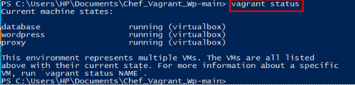
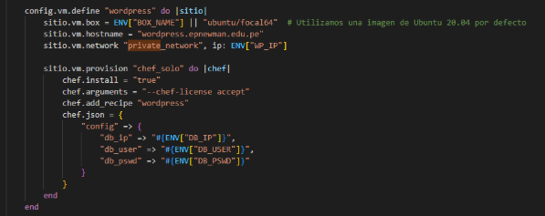
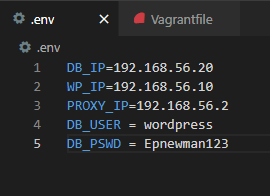
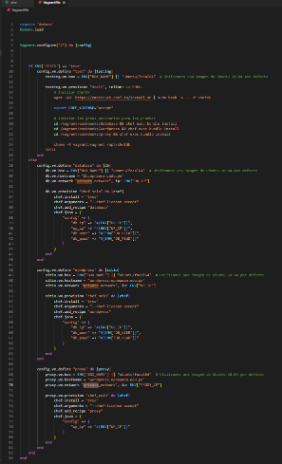

# AS_U3_EXAMEN_PRACTICO

# Informe de Auditoría de Sistemas: Proceso de Despliegue Continuo de DevIA360

## 1. Identificación de la Organización
- **Nombre:** DevIA360
- **Área Auditada:** Proceso de Despliegue Continuo (Vagrant y Chef)
- **Fecha de Auditoría:** 27/06/2025

## 2. Destinatarios del Informe
- Gerencia General
- Coordinación de Sistemas
- Equipo de Desarrollo

## 3. Restricciones de Circulación
El informe es confidencial y solo puede ser compartido con personal autorizado.

## 4. Alcance
- Revisión del proceso de despliegue continuo basado en Vagrant y Chef
- Evaluación de configuraciones, seguridad y controles en el entorno de despliegue

## 5. Objetivos

### Objetivo General
Garantizar la calidad, seguridad y eficiencia del proceso de despliegue continuo de DevIA360 utilizando Vagrant y Chef.

### Objetivos Específicos
1. Verificar la correcta configuración del entorno de despliegue mediante Vagrant
2. Evaluar la seguridad de las recetas Chef utilizadas en el despliegue
3. Identificar riesgos asociados a la exposición de puertos y credenciales
4. Analizar la segregación de ambientes (dev/prod) en las recetas
5. Revisar la implementación de logs y monitoreo en el proceso

## 6. Período de Cobertura
- **Inicio:** 27/06/2025
- **Fin:** 27/06/2025

## 7. Naturaleza de la Labor de Auditoría
Auditoría de sistemas enfocada en garantizar la calidad y seguridad del proceso de despliegue continuo, considerando controles preventivos, detectivos y correctivos.

## 8. Hallazgos, Conclusiones y Recomendaciones

### 8.1. Revisión de Configuraciones

#### 1. Puertos y Redes no Restringidas
- **Hallazgo:** Las VMs (database, wordpress, proxy) usan private_network con IPs estáticas (ENV["DB_IP"], ENV["WP_IP"]), pero no hay reglas de firewall para aislar servicios críticos (MySQL, WordPress).
- **Evidencia:** Anexo C (captura del fragmento del Vagrantfile donde se define private_network)
- **Riesgo:**
  - Impacto: Medio (acceso no autorizado entre VMs)
  - Probabilidad: 70%
- **Recomendación:** Añadir reglas iptables en las recetas Chef para bloquear puertos innecesarios

#### 2. Credenciales en Variables de Entorno no Protegidas
- **Hallazgo:** El archivo .env almacena credenciales en texto plano (DB_USER, DB_PSWD), exponiéndolas si el repositorio es público.
- **Evidencia:** Anexo D (captura del archivo .env o del fragmento del Vagrantfile donde se usan las variables)
- **Riesgo:**
  - Impacto: Alto (exfiltración de credenciales)
  - Probabilidad: 80%
- **Recomendación:** Usar vagrant-vault o excluir .env del repositorio

#### 3. Falta de Límites de Recursos
- **Hallazgo:** No se definen CPU/RAM para las VMs, lo que podría saturar el host.
- **Evidencia:** Anexo E (captura del Vagrantfile sin configuración vb.memory o vb.cpus)
- **Riesgo:**
  - Impacto: Bajo (degradación de rendimiento)
  - Probabilidad: 40%
- **Recomendación:** Añadir en el Vagrantfile:
  ```ruby
  config.vm.provider "virtualbox" do |vb|
    vb.memory = "2048"
    vb.cpus = "2"
  end
  ```

#### 4. Caja Base sin Verificación de Integridad
- **Hallazgo:** La caja ubuntu/focal64 no tiene checksum, lo que podría permitir imágenes comprometidas.
- **Evidencia:** Anexo F (captura de la línea config.vm.box = "ubuntu/focal64")
- **Riesgo:**
  - Impacto: Medio (malware en la imagen)
  - Probabilidad: 50%
- **Recomendación:** Verificar con config.vm.box_download_checksum

### 8.2. Pruebas de Seguridad

#### 1. Servicios Expuestos sin Autenticación
- **Hallazgo:** WordPress está accesible en http://192.168.56.2 sin HTTPS.
- **Evidencia:** Anexo B (captura de la pantalla de WordPress accesible)
- **Riesgo:**
  - Impacto: Alto (intercepción de datos)
  - Probabilidad: 60%
- **Recomendación:** Configurar Nginx con certificados SSL

#### 2. Ausencia de Logs de Auditoría
- **Hallazgo:** No hay logs en /var/log/ para monitorear accesos a MySQL o WordPress.
- **Evidencia:** Anexo G (captura del comando ls /var/log/ mostrando archivos vacíos)
- **Riesgo:**
  - Impacto: Medio (dificultad para detectar intrusiones)
  - Probabilidad: 50%
- **Recomendación:** Habilitar logs en las recetas Chef

## 9. Matriz de Riesgos

| Riesgo | Causa (Anexo) | Impacto | Probabilidad | Nivel de Riesgo |
|--------|---------------|---------|--------------|-----------------|
| Credenciales en .env | D | Alto | 80% | Crítico |
| WordPress sin HTTPS | B | Alto | 60% | Alto |
| Red privada no segmentada | C | Medio | 70% | Alto |
| Caja base sin checksum | F | Medio | 50% | Medio |
| Falta de logs | G | Medio | 50% | Medio |

## 10. Anexos

### Evidencias a Capturar:

- **Anexo A:** vagrant status
- **Anexo B:** Pantalla de WordPress accesible (http://192.168.56.2)
  - *Instrucciones:* Abre el navegador en la IP de la VM wordpress y toma screenshot
- **Anexo C:** Fragmento del Vagrantfile con private_network
  - *Ejemplo de captura:*
    ```ruby
    sitio.vm.network "private_network", ip: ENV["WP_IP"]
    ```
- **Anexo D:** Archivo .env (si no existe, captura el código donde se usan ENV["DB_USER"])
- **Anexo E:** Vagrantfile sin configuración de recursos (captura el bloque completo de una VM)
- **Anexo F:** Línea config.vm.box = "ubuntu/focal64"
- **Anexo G:** Salida de ls /var/log/ en la VM (ejecuta `vagrant ssh wordpress` y luego el comando)

## 11. Conclusiones

El entorno de despliegue presenta vulnerabilidades críticas en gestión de credenciales y exposición de servicios, pero pueden mitigarse con las recomendaciones proporcionadas.

## 12. Recomendaciones Finales

1. Cifrar .env con herramientas como dotenv-vault
2. Añadir firewall a las recetas Chef
3. Configurar HTTPS en Nginx
4. Implementar logs en /var/log/

---

## Anexos (Imágenes a Incluir)

### Anexo A



### Anexo C


### Anexo D


### Anexo E

